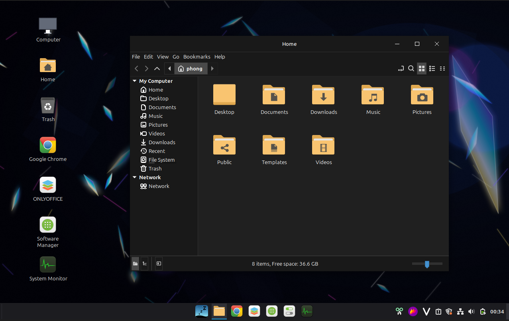

# NapOS

> A beginner-friendly Linux distribution for Vietnamese based on Linux Mint using ISO remastering technique



## Chào mừng bạn đến với NapOS

NapOS được tạo ra để giúp người dùng Việt Nam, đặc biệt là những bạn mới
làm quen với Linux, có thể bắt đầu thật dễ dàng. Giao diện quen thuộc, bộ gõ
tiếng Việt và các ứng dụng thiết yếu đã sẵn sàng để bạn học tập, làm việc
và giải trí. Hãy tải NapOS và khám phá một cách nhẹ nhàng để bước vào thế
giới Linux.

### Điều gì làm NapOS đặc biệt?

- **Sẵn sàng gõ tiếng Việt.** Fcitx5 Lotus được cấu hình sẵn, giúp bạn
  nhập tiếng Việt thuận tiện trong các ứng dụng được hỗ trợ.
- **Giao diện thân thiện, quen thuộc.** Môi trường Cinnamon mang phong cách
  gần gũi với Windows, kết hợp giao diện tối tinh tế và các biểu tượng
  truy cập nhanh vào máy tính, thư mục cá nhân, thùng rác và ổ đĩa.
- **Ứng dụng thiết yếu đã được cài đặt.** Duyệt web bằng Google Chrome,
  làm việc với tài liệu Microsoft Office trong ONLYOFFICE, và thưởng thức âm
  nhạc, video bằng VLC.
- **Công cụ hữu ích luôn trong tầm tay.** Chụp và chú thích màn hình với
  Flameshot, cài thêm ứng dụng qua Software Manager, và xem lại lịch sử bộ
  nhớ tạm bằng CopyQ với phím tắt `Super+V`.
- **Phông chữ quen thuộc cho tài liệu.** Bộ phông chữ thông dụng của Microsoft
  giúp tài liệu giữ được hình thức quen thuộc khi chuyển đổi giữa Linux
  và Windows.
- **Được xây dựng trên Linux Mint.** NapOS kế thừa nền tảng Linux Mint 22.3
  Cinnamon ổn định, thân thiện, đồng thời bổ sung bản sắc hình ảnh, lựa
  chọn ứng dụng và thiết lập phù hợp hơn với người dùng Việt Nam.

**[Download NapOS from GitHub Releases →](https://github.com/phongna07/NapOS/releases)**

## Linux that feels familiar

NapOS brings together the reliability of Linux Mint and a carefully prepared
Cinnamon desktop. Its familiar layout, centered taskbar, dark theme, clear
desktop shortcuts, and original NapOS artwork make the first login feel
approachable instead of overwhelming.

It is designed for people who want Linux to be useful from the start. Common
applications, sensible defaults, Vietnamese typing, and everyday conveniences
are already in place, while the full flexibility of Linux remains available as
you grow more confident.

## Ready for daily use

NapOS chooses practical defaults so beginners have fewer setup decisions to
make. Chrome opens web links, ONLYOFFICE handles common office document formats,
and VLC plays popular audio and video files. Frequently used applications are
placed directly on the desktop and taskbar, making them easy to discover.

You can boot NapOS into a live environment to explore the desktop before making
changes to your computer. When you are ready, launch **Install NapOS** from the
desktop and follow the guided installer.

## Download NapOS

Installation images are published on the
**[NapOS Releases page](https://github.com/phongna07/NapOS/releases)**. Choose the
latest release and review its accompanying notes before downloading.

NapOS currently targets 64-bit PCs (`amd64`). Back up important files before
installing any operating system.

## For contributors

NapOS is produced by remastering an authenticated Linux Mint ISO. The repository
contains the build workflow, package policy, desktop configuration, artwork,
and non-networked test suite.

```bash
make help
make test
```

`make help` lists the supported development commands, while `make test` runs
the routine checks without requiring root access or a network connection.

## License

Original NapOS build scripts and artwork are licensed under
[GPL-3.0-only](LICENSE). Linux Mint and bundled applications retain their own
licenses. The image includes third-party software and fonts, including Google
Chrome and Microsoft core fonts, which are governed by separate terms; review
those terms before redistributing a NapOS image.
